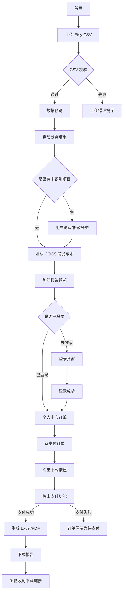

# Etsy Tax Profit Report 产品需求文档

## 1. 产品概述

### 1.1 产品定位

Etsy Tax Profit Report 是一个面向 Etsy 小卖家的低价一次性报税利润报表工具。

用户上传 Etsy 导出的 CSV 文件，系统自动整理全年收入、退款、平台费用、广告费、运费标签、销售税和利润，并生成一份可交给 CPA/会计参考的 Excel/PDF 报税利润包。

### 1.2 一句话描述

用户上传 Etsy CSV，拿到一份可以发给 CPA 的年度利润报表包。

### 1.3 核心价值

- 不要求用户连接 Etsy 账号
- 不要求用户注册账号后才能使用
- 不做复杂会计软件
- 先免费预览结果，下载完整报告时再付费
- 帮助用户把混乱 CSV 整理成 CPA 能看懂的报表

### 1.4 目标用户

- Etsy 小卖家
- 副业卖家
- 手工艺品卖家
- 数字产品卖家
- 没有专职会计的个人卖家
- 报税季临时需要整理收入和费用的卖家

### 1.5 产品价格

MVP 阶段只提供一个付费方案：

| 方案 | 价格 | 内容 |
| --- | ---: | --- |
| One-time Etsy Tax Report | $19 | 单店铺、单年份、Excel + PDF 下载 |

后续可扩展：

| 方案 | 价格 | 内容 |
| --- | ---: | --- |
| Annual Plan | $49/年 | 每年生成报告，保存历史 |
| Multi-store Plan | $99/年 | 多店铺、多年份、多平台 |

## 2. MVP 范围

### 2.1 MVP 必做功能

| 模块 | 功能点 | 优先级 |
| --- | --- | --- |
| 首页 | 说明产品价值，引导上传 Etsy CSV | P0 |
| 文件上传 | 支持上传 Etsy CSV 文件 | P0 |
| 文件校验 | 判断文件格式、大小、是否为空、字段是否匹配 | P0 |
| 报告年份 | 用户选择要生成的报表年份 | P0 |
| 数据预览 | 显示文件名、日期范围、交易数量、字段和样例数据 | P0 |
| 自动分类 | 自动分类收入、退款、手续费、广告费、运费标签、销售税等 | P0 |
| 分类确认 | 用户查看分类金额和原始明细 | P0 |
| 手动修正 | 用户修改未识别项目或错误分类 | P0 |
| COGS 输入 | 用户手动输入商品成本，也可以跳过 | P0 |
| 利润预览 | 展示年度和月度利润预览 | P0 |
| 登录判断 | 用户点击下载时判断是否已登录 | P0 |
| 登录弹窗 | 未登录用户先完成登录，再继续订单流程 | P0 |
| 个人中心 | 展示用户历史订单、待支付订单和可下载报告 | P0 |
| 订单管理 | 为每次报告生成一个订单，支持待支付、已支付、生成中、可下载状态 | P0 |
| 付费解锁 | 用户在订单中点击下载/支付，支付 $19 后解锁完整报告 | P0 |
| Excel 导出 | 生成 CPA/报税用 Excel 文件 | P0 |
| PDF 导出 | 生成 CPA/报税用 PDF 文件 | P0 |
| 邮件链接 | 支付后发送下载链接到邮箱 | P0 |

### 2.2 MVP 暂不做

- 不做 eBay
- 不做 Shopify
- 不做完整会计软件
- 不做自动报税申报
- 不做税务建议
- 不做 QuickBooks/Xero 同步
- 不做 Etsy API 自动连接
- 不做复杂库存管理
- 不做 SKU 级利润
- 不做长期订阅为主的复杂 SaaS
- 不做多店铺管理

## 3. 用户主流程

### 3.1 主路径

1. 用户进入首页
2. 用户点击上传 Etsy CSV
3. 用户选择报告年份
4. 用户上传 CSV 文件
5. 系统校验 CSV 是否有效
6. 系统展示数据预览
7. 用户确认文件正确
8. 系统自动分类收入、退款、费用和税
9. 用户查看分类结果
10. 用户确认或修改未识别项目
11. 用户填写商品成本 COGS，或选择跳过
12. 系统生成利润报告预览
13. 用户点击下载完整报告
14. 系统判断用户是否已登录
15. 如果用户未登录，系统弹出登录界面
16. 用户完成登录
17. 系统进入个人中心，并生成一条待支付订单
18. 用户在订单中点击下载按钮
19. 系统弹出支付功能
20. 用户支付 $19
21. 系统生成 Excel/PDF
22. 用户下载报告
23. 系统向用户邮箱发送下载链接

### 3.2 流程图



## 4. 页面交互设计

### 4.1 首页

#### 页面目的

让用户快速理解产品，并开始上传 CSV。

#### 页面内容

- 主标题：Upload your Etsy CSV. Get a CPA-ready profit report.
- 副标题：整理全年收入、退款、手续费、广告费、运费标签和利润。
- 主按钮：Upload Etsy CSV
- 次按钮：View sample report
- 信任提示：
  - No Etsy account connection required
  - Free preview before payment
  - Pay only when you download
  - Excel and PDF included

#### 用户操作

| 用户动作 | 系统响应 |
| --- | --- |
| 点击 Upload Etsy CSV | 进入上传页 |
| 点击 View sample report | 打开示例报告预览 |

### 4.2 上传页

#### 页面目的

让用户上传 Etsy CSV，并选择报告年份。

#### 页面内容

- 拖拽上传区域
- 点击选择文件按钮
- 文件格式提示：CSV only
- Etsy 文件来源说明
- 报告年份选择
- 货币选择，可默认自动识别

#### 用户操作

| 用户动作 | 系统响应 |
| --- | --- |
| 拖入 CSV 文件 | 开始上传和校验 |
| 点击选择文件 | 打开本地文件选择器 |
| 选择报告年份 | 保存年份设置 |
| 点击 Continue | 进入文件校验 |

#### 校验规则

- 文件必须是 CSV
- 文件不能为空
- 文件大小不能超过系统限制
- 文件必须包含可识别字段
- 文件日期应与用户选择的报告年份相关

### 4.3 数据预览页

#### 页面目的

让用户确认系统读取的是正确文件。

#### 页面内容

- 文件名
- 文件大小
- 识别到的日期范围
- 识别到的交易数量
- 识别到的字段列表
- 前 10 行数据预览
- 继续按钮：Looks good, analyze my CSV
- 返回按钮：Upload another file

#### 用户操作

| 用户动作 | 系统响应 |
| --- | --- |
| 点击 Looks good, analyze my CSV | 进入自动分类 |
| 点击 Upload another file | 返回上传页 |

#### 特殊提示

如果 CSV 里包含用户选择年份之外的数据，系统提示：

```text
This CSV contains transactions outside the selected year. Continue anyway?
```

### 4.4 自动分类结果页

#### 页面目的

展示系统将 CSV 自动分类后的结果。

#### 页面内容

| 分类 | 金额 | 记录数 | 状态 |
| --- | ---: | ---: | --- |
| Gross Sales | $12,400 | 320 | 已识别 |
| Refunds | -$620 | 12 | 已识别 |
| Transaction Fees | -$780 | 320 | 已识别 |
| Payment Processing Fees | -$410 | 320 | 已识别 |
| Listing Fees | -$120 | 80 | 已识别 |
| Etsy Ads | -$950 | 48 | 已识别 |
| Offsite Ads | -$310 | 10 | 已识别 |
| Shipping Labels | -$1,120 | 190 | 已识别 |
| Sales Tax | $860 | 210 | 单独列示 |
| Uncategorized | -$73 | 6 | 需要确认 |

#### 用户操作

| 用户动作 | 系统响应 |
| --- | --- |
| 点击某个分类 | 展开原始交易明细 |
| 点击 Review Uncategorized | 进入分类修正页 |
| 点击 Continue | 进入 COGS 页面 |

#### 交互要求

- 每个分类都能查看来源记录
- 每个金额都要能追溯到原始 CSV 行
- 未识别项目不能被隐藏

### 4.5 分类修正页

#### 页面目的

让用户确认未识别或可能错误分类的交易。

#### 页面内容

- 未确认交易列表
- 每条记录显示：
  - 日期
  - 描述
  - 金额
  - 原始字段
  - 当前分类
- 分类选择器：
  - Gross Sales
  - Refunds
  - Transaction Fees
  - Payment Processing Fees
  - Listing Fees
  - Etsy Ads
  - Offsite Ads
  - Shipping Labels
  - Sales Tax
  - Other Expense
  - Ignore
  - Not sure
- 批量修改入口
- 识别率提示

#### 用户操作

| 用户动作 | 系统响应 |
| --- | --- |
| 修改单条分类 | 实时更新分类结果 |
| 批量选择分类 | 批量更新记录 |
| 点击 Apply changes | 保存修正结果 |
| 点击 Continue to COGS | 进入 COGS 页面 |

### 4.6 COGS 商品成本页

#### 页面目的

补充 Etsy CSV 中没有的商品成本。

#### 页面说明

Etsy CSV 通常不包含商品成本。为了计算更接近真实利润的结果，用户需要手动填写 COGS。

#### 页面内容

用户可以选择三种方式：

| 选项 | 说明 |
| --- | --- |
| I know my total annual product cost | 填写全年商品成本 |
| Enter monthly product costs | 按月份填写商品成本 |
| Skip for now | 暂时跳过商品成本 |

#### 用户操作

| 用户动作 | 系统响应 |
| --- | --- |
| 输入全年 COGS | 更新估算利润 |
| 输入每月 COGS | 更新月度利润表 |
| 点击 Skip for now | 进入报告预览，并标注未扣除 COGS |

#### 重要规则

如果用户跳过 COGS，报告必须显示：

```text
Profit does not include product costs because COGS was not provided.
```

### 4.7 利润报告预览页

#### 页面目的

让用户在付款前看到核心结果，提高付费转化。

#### 页面内容

- 年度汇总
  - Gross Sales
  - Refunds
  - Net Sales
  - Platform Fees
  - Ads
  - Shipping Labels
  - COGS
  - Estimated Profit
- 月度利润表预览
- 报告质量提示
  - 已分析交易数量
  - 自动识别率
  - 未识别项目数量
  - 是否填写 COGS
- 锁定下载区
  - Excel locked
  - PDF locked
- 主按钮：Download full report - $19
- 返回入口：
  - Edit categories
  - Edit COGS

#### 用户操作

| 用户动作 | 系统响应 |
| --- | --- |
| 点击 Download full report - $19 | 判断用户是否已登录 |
| 点击 Edit categories | 返回分类页 |
| 点击 Edit COGS | 返回 COGS 页面 |

#### 登录判断规则

| 用户状态 | 系统响应 |
| --- | --- |
| 已登录 | 创建或更新待支付订单，并进入个人中心订单区域 |
| 未登录 | 弹出登录界面 |
| 登录失败 | 停留在当前利润预览页，不丢失报告草稿 |
| 登录成功 | 进入个人中心订单区域 |

### 4.8 登录弹窗

#### 页面目的

让未登录用户先完成登录，再继续支付和下载流程。

#### 页面内容

- 邮箱输入框
- 验证码或密码输入区域
- 主按钮：Log in to continue
- 次按钮：Create account
- 提示：登录后可在个人中心查看订单和重新下载报告

#### 用户操作

| 用户动作 | 系统响应 |
| --- | --- |
| 输入邮箱并登录 | 校验登录状态 |
| 登录成功 | 进入个人中心订单区域 |
| 登录失败 | 显示错误提示，允许重试 |
| 关闭弹窗 | 返回利润报告预览页，保留当前报告草稿 |

#### 业务规则

- 上传 CSV 和查看利润预览不要求登录
- 点击下载完整报告时必须登录
- 登录成功后，系统把当前报告草稿绑定到该用户账号
- 用户后续可在个人中心找回该报告订单

### 4.9 个人中心订单页

#### 页面目的

让用户在个人信息界面查看订单，并从订单中继续支付或下载报告。

#### 页面内容

- 用户邮箱
- 订单列表
- 每个订单显示：
  - 报告名称
  - 平台：Etsy
  - 报告年份
  - 订单金额：$19
  - 订单状态
  - 创建时间
  - 下载按钮或支付按钮

#### 订单状态

| 状态 | 含义 | 用户可操作 |
| --- | --- | --- |
| Draft | 已生成预览，尚未创建支付订单 | 返回编辑 |
| Pending Payment | 待支付 | 点击下载按钮，弹出支付功能 |
| Paid | 已支付，等待生成报告 | 查看生成进度 |
| Generating | 报告生成中 | 等待 |
| Ready | 报告已生成 | 下载 Excel/PDF |
| Failed | 报告生成失败 | 联系支持或申请退款 |

#### 用户操作

| 用户动作 | 系统响应 |
| --- | --- |
| 点击待支付订单的下载按钮 | 弹出支付功能 |
| 点击已完成订单的下载按钮 | 打开下载页 |
| 点击订单详情 | 查看报告摘要、金额和状态 |
| 点击重新生成报告 | 基于最新分类和 COGS 重新生成 |

### 4.10 支付弹窗

#### 页面目的

用户从个人中心订单中发起支付，支付成功后解锁报告。

#### 页面内容

- 订单摘要
  - Product: Etsy Tax Profit Report
  - Year: 用户选择年份
  - Includes: Excel + PDF
  - Price: $19
- 支付按钮：Pay $19 and generate report
- 关闭按钮
- 支付失败提示区域

#### 用户操作

| 用户动作 | 系统响应 |
| --- | --- |
| 点击支付按钮 | 进入支付流程 |
| 支付成功 | 进入报告生成页 |
| 支付失败 | 订单保留为待支付，允许重新支付 |
| 关闭支付弹窗 | 返回个人中心订单页 |

#### 支付规则

- 支付必须从用户订单发起
- 支付成功后订单状态改为 Paid 或 Generating
- 支付失败不删除订单
- 用户可以稍后回到个人中心继续支付

### 4.11 报告生成页

#### 页面目的

告诉用户系统正在生成最终 Excel/PDF 文件。

#### 页面内容

- 生成进度：
  - Preparing Excel workbook
  - Creating CPA-ready PDF
  - Securing download link
- 提示文案：

```text
This usually takes less than 60 seconds.
```

#### 系统结果

| 结果 | 系统响应 |
| --- | --- |
| 生成成功 | 进入下载页 |
| 生成失败 | 显示错误，提示联系客服或退款 |

### 4.12 下载页

#### 页面目的

交付最终报告。

#### 页面内容

- 成功提示：Your Etsy tax profit report is ready.
- 下载按钮：
  - Download Excel
  - Download PDF
- 邮件提示：A copy of this download link has been sent to your email.
- 下载链接有效期：7 天
- 下载次数限制：最多 5 次
- 次按钮：Generate another report

#### 用户操作

| 用户动作 | 系统响应 |
| --- | --- |
| 点击 Download Excel | 下载 Excel 文件 |
| 点击 Download PDF | 下载 PDF 文件 |
| 点击 Generate another report | 返回上传流程 |

## 5. 自动分类规则

### 5.1 支持的分类

| 分类 | 说明 | 是否计入利润计算 |
| --- | --- | --- |
| Gross Sales | 商品销售收入 | 是，计入收入 |
| Shipping Charged | 向买家收取的运费 | 是，计入收入 |
| Refunds | 退款 | 是，从收入扣除 |
| Discounts | 优惠券、折扣 | 是，从收入扣除 |
| Sales Tax | 平台代收销售税 | 单独列示，默认不计入卖家收入 |
| Transaction Fees | Etsy 交易手续费 | 是，计入费用 |
| Payment Processing Fees | 支付处理费 | 是，计入费用 |
| Listing Fees | 上架费 | 是，计入费用 |
| Etsy Ads | Etsy 站内广告费 | 是，计入费用 |
| Offsite Ads | Etsy 站外广告费 | 是，计入费用 |
| Shipping Labels | 平台购买的运费标签成本 | 是，计入费用 |
| Adjustments | 调整项 | 视具体类型处理 |
| Deposits | Etsy 打款记录 | 用于对账，不直接算收入 |
| Uncategorized | 未识别项目 | 需要用户确认 |

### 5.2 利润计算公式

```text
Net Sales = Gross Sales + Shipping Charged - Refunds - Discounts

Platform Expenses = Transaction Fees
                  + Payment Processing Fees
                  + Listing Fees
                  + Etsy Ads
                  + Offsite Ads
                  + Shipping Labels
                  + Other Expenses

Estimated Profit = Net Sales - Platform Expenses - COGS
```

### 5.3 Sales Tax 处理规则

Sales Tax 需要单独列示，不应默认当成卖家真实收入。

报告里要标注：

```text
Sales tax is shown separately because marketplace-collected tax may not represent seller revenue.
```

### 5.4 Deposit 处理规则

Deposit 是平台打款记录，不等同于销售收入。

处理方式：

- Deposit 用于对账
- 不直接计入 Gross Sales
- 如果 Deposit 与系统计算的净额差异过大，需要提示用户检查

### 5.5 COGS 处理规则

COGS 由用户手动填写。

如果用户不填写 COGS：

- 报告仍可生成
- Estimated Profit 标注为未扣除商品成本
- PDF 和 Excel 都要包含提醒

## 6. 报表交付物

### 6.1 Excel 文件内容

Excel 文件建议包含以下 Sheet：

| Sheet | 内容 |
| --- | --- |
| Summary | 年度收入、费用、利润汇总 |
| Monthly P&L | 月度利润表 |
| Category Breakdown | 各分类金额汇总 |
| Transactions | 原始交易明细和系统分类结果 |
| Uncategorized | 未识别或用户标记为不确定的项目 |
| COGS Input | 用户填写的商品成本 |
| Notes | 分类说明、计算口径、免责声明 |

### 6.2 PDF 文件内容

PDF 用于给 CPA/会计快速查看，内容应简洁正式。

PDF 包含：

- 报告封面
- 店铺名称，若未知则显示 Etsy Shop
- 报告年份
- 生成日期
- 年度利润汇总
- 月度利润表
- 费用分类汇总
- COGS 状态说明
- 未识别项目提醒
- 免责声明

### 6.3 免责声明

报告必须包含以下免责声明：

```text
This report is generated based on CSV files uploaded by the user. It is provided for bookkeeping and tax preparation reference only and does not constitute tax, legal, or accounting advice. Please consult a qualified tax professional before filing.
```

## 7. 异常流程

| 场景 | 系统处理 |
| --- | --- |
| 用户上传的不是 CSV | 提示只支持 CSV，并要求重新上传 |
| CSV 为空 | 提示文件为空 |
| CSV 缺少关键字段 | 显示缺少字段，并要求重新上传正确文件 |
| CSV 不是 Etsy 文件 | 提示无法识别为 Etsy CSV |
| CSV 日期与选择年份不一致 | 提醒用户确认是否继续 |
| 文件可能重复上传 | 提醒用户检查是否重复 |
| 系统有未识别交易 | 引导用户进入分类修正页 |
| 用户跳过 COGS | 报告标注利润未扣除商品成本 |
| 用户点击下载但未登录 | 弹出登录界面 |
| 用户登录失败 | 保留报告预览，允许重新登录 |
| 用户关闭登录弹窗 | 返回利润预览页，不丢失报告草稿 |
| 用户登录成功 | 绑定报告草稿，进入个人中心订单页 |
| 用户付款失败 | 订单保留为待支付，允许重新付款 |
| 用户支付成功但报告未生成 | 订单显示生成中 |
| 报告生成失败 | 提示联系客服或退款 |
| 下载链接过期 | 提供重新发送链接入口 |
| 用户下载次数达到限制 | 提示联系支持 |

## 8. 后台管理需求

### 8.1 订单管理

管理员需要查看：

- 用户 ID
- 用户邮箱
- 订单 ID
- 订单状态
- 支付金额
- 支付状态
- 报告年份
- 报告生成状态
- 下载次数
- 创建时间

订单状态至少包括：

| 状态 | 说明 |
| --- | --- |
| Draft | 用户已生成预览，但未进入支付 |
| Pending Payment | 用户已登录并生成待支付订单 |
| Paid | 用户已支付 |
| Generating | 报告生成中 |
| Ready | 报告可下载 |
| Failed | 报告生成失败 |

### 8.2 上传失败记录

系统需要记录：

- 上传失败文件类型
- 失败原因
- 缺少字段
- 用户选择年份
- 发生时间

用途：帮助后续优化 CSV 识别能力。

### 8.3 未识别字段统计

系统需要统计用户上传 CSV 中经常出现但未被识别的字段或交易描述。

用途：持续优化自动分类规则。

### 8.4 退款与支持

后台需要支持：

- 查看订单详情
- 重新发送下载链接
- 标记报告生成失败
- 手动退款
- 查看用户反馈

## 9. 信任与转化设计

### 9.1 降低使用阻力

- 上传前不要求注册
- 上传前不要求邮箱
- 不要求连接 Etsy 账号
- 先展示利润预览，再要求登录和付款
- 只有点击下载完整报告时才要求登录
- 登录后在个人中心继续支付和下载

### 9.2 提高用户信任

- 每个分类金额都能追溯到原始 CSV 行
- 未识别项目明确提示
- COGS 是否填写明确标注
- Sales Tax 单独列示
- Deposit 不直接当收入
- 报告包含计算口径说明
- 个人中心保留订单，方便用户找回报告

### 9.3 付费转化点

用户在利润报告预览页看到核心价值后，点击下载完整报告。

系统先判断用户是否已登录：

- 已登录：进入个人中心订单页
- 未登录：弹出登录界面

用户在个人中心订单页点击下载按钮后，系统弹出支付功能。

支付前展示：

- 已分析交易数量
- 自动分类识别率
- 年度利润预览
- Excel/PDF 文件内容
- $19 一次性价格
- 当前订单状态

## 10. 成功指标

| 指标 | 说明 |
| --- | --- |
| 上传转化率 | 首页访问用户中上传 CSV 的比例 |
| 上传成功率 | 上传 CSV 中成功识别的比例 |
| 自动分类识别率 | 系统自动分类的交易占比 |
| 分类修正率 | 用户手动修改分类的比例 |
| 预览到登录转化率 | 看到利润预览后点击下载并完成登录的比例 |
| 登录到订单转化率 | 登录成功后生成待支付订单的比例 |
| 订单到支付转化率 | 待支付订单完成付款的比例 |
| 支付成功率 | 弹出支付功能后完成付款的比例 |
| 报告生成成功率 | 付款后成功生成报告的比例 |
| 下载成功率 | 成功下载 Excel/PDF 的比例 |
| 支持请求率 | 用户生成报告后联系支持的比例 |

## 11. 最小可卖版本

第一版只保留以下 10 个功能即可上线验证：

1. Etsy CSV 上传
2. 自动分类收入、退款、费用和税
3. 未识别项目提示
4. 手动输入 COGS 或跳过
5. 年度利润汇总
6. 月度利润表
7. 点击下载时判断是否登录
8. 未登录时弹出登录界面
9. 个人中心展示订单和下载按钮
10. $19 付费下载 Excel/PDF

## 12. 后续版本方向

### 12.1 第二阶段

- 支持多个 Etsy CSV 文件合并
- 支持更多 Etsy 导出格式
- 支持按 SKU 输入 COGS
- 增加报告找回页面
- 增加 CPA 分享链接
- 增加订单搜索和筛选

### 12.2 第三阶段

- 支持 eBay
- 支持 Shopify
- 支持多店铺
- 支持年度订阅
- 支持 QuickBooks/Xero 导出格式

## 13. 当前推荐决策

第一版应选择“一次性 CSV 报税包型”流程：

```text
首页 -> 上传 CSV -> 数据预览 -> 自动分类 -> 修正未识别项目 -> 填写 COGS -> 利润预览 -> 点击下载 -> 登录判断 -> 个人中心订单 -> 弹出支付 -> 下载 Excel/PDF
```

核心原则：

- 上传在前
- 预览在前
- 登录和付款在后
- 用户订单集中在个人中心管理
- 报告结果必须可追溯
- 不假装提供税务建议
